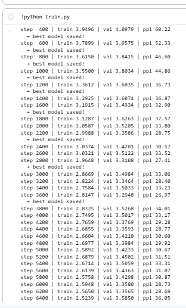
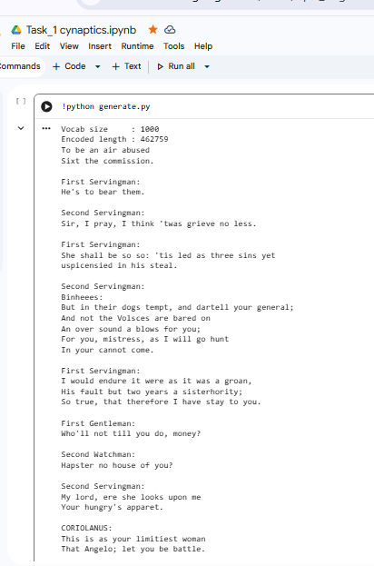

# Task 1 — GPT Shakespeare: Pretraining from Scratch

## Overview
A decoder-only GPT-style Transformer built entirely from scratch using PyTorch,
trained on the Tiny Shakespeare dataset (~1M characters) to generate
Shakespeare-style text by predicting the next token in a sequence.

No pretrained weights used — every component is hand-written including
a custom BPE tokenizer trained specifically on Shakespeare data.

---

## Project Structure
```
Task1/
├── src/
│   ├── tokenizer.py    ← custom BPE tokenizer
│   ├── data.py         ← dataset loading + batch generation
│   ├── attention.py    ← masked single + multi head attention
│   ├── ffn.py          ← feed forward network
│   ├── block.py        ← transformer block
│   └── model.py        ← full GPT model
├── config.py           ← all hyperparameters
├── train.py            ← pretraining loop
├── generate.py         ← text generation script
└── README.md
```

---

## Setup
```bash
pip install torch tokenizers
```

## Download Dataset
```bash
mkdir data
curl -o data/input.txt https://raw.githubusercontent.com/karpathy/char-rnn/master/data/tinyshakespeare/input.txt
```

## How to Train
```bash
python train.py
```

## How to Generate
```bash
python generate.py
```

---

## Model Architecture

```
Input tokens (B, T)
        ↓
Token Embedding + Positional Embedding
        ↓
┌─────────────────────────┐
│   Transformer Block × 6  │
│  ┌───────────────────┐  │
│  │    LayerNorm       │  │
│  │    Masked MHA      │  │
│  │    Residual +      │  │
│  │    LayerNorm       │  │
│  │    FeedForward     │  │
│  │    Residual +      │  │
│  └───────────────────┘  │
└─────────────────────────┘
        ↓
Final LayerNorm
        ↓
Linear → logits (vocab_size)
```

---

## Hyperparameters

| Parameter     | Value  | Explanation                     |
|---------------|--------|---------------------------------|
| d_model       | 256    | embedding dimension             |
| n_heads       | 8      | attention heads                 |
| n_layers      | 6      | transformer blocks              |
| block_size    | 128    | context length                  |
| batch_size    | 64     | sequences per step              |
| vocab_size    | 1000   | custom BPE vocabulary           |
| learning rate | 3e-4   | AdamW optimizer                 |
| max_iters     | 10000  | total training steps            |
| dropout       | 0.2    | regularization                  |
| scheduler     | Cosine | learning rate decay             |

---

## Tokenizer
Custom Byte Pair Encoding (BPE) tokenizer trained on Shakespeare data.

| Tokenizer       | Vocab size | Suitability        |
|-----------------|------------|--------------------|
| Character level | 65         | too basic          |
| Custom BPE      | 1000       | perfect ✅          |
| GPT-2 pretrained| 50,257     | too large          |

---

## Training Results

| Step  | Train Loss | Val Loss | Perplexity |
|-------|------------|----------|------------|
| 0     | 7.079      | 6.86     | 962.71     |
| 200   | 4.317      | 4.372    | 79.25      |
| 2000  | 3.05       | 3.52     | 33.80      |
| 5000  | 2.58       | 3.42     | 30.67      |
| 9800  | 2.46       | 3.46     | 31.92      |

---

## Sample Output
```
To be an air abused
Sixt the commission.

First Servingman:
He's to bear them.

Second Servingman:
Sir, I pray, I think 'twas grieve no less.

First Servingman:
She shall be so so: 'tis led as three sins yet
uspicensied in his steal.

Second Servingman:
Binheees:
But in their dogs tempt, and dartell your general;
And not the Volsces are bared on
An over sound a blows for you;
For you, mistress, as I will go hunt
In your cannot come.

First Servingman:
I would endure it were as it was a groan,
His fault but two years a sisterhority;
So true, that therefore I have stay to you.

First Gentleman:
Who'll not till you do, money?

Second Watchman:
Hapster no house of you?

Second Servingman:
My lord, ere she looks upon me
Your hungry's apparet.

CORIOLANUS:
This is as your limitiest woman
That Angelo; let you be battle.

CORIOLANUS:
I tongues, consudges, credit no first.

CORIOLANUS:
Ay, do feel 't.

CORIOLANUS:
I should not wrong aundred, for it.

CORIOLANUS:
That will not so contrive: I
From love a grave as I jot upon thee,
As I have poison'd my hand of my ancient:
So was breathed; though crown'd, man
Of my letters adversition, when 'tis
To stole jealous queen, and my highness cannibble.

First Citizen:
No, he's one
```

---
## Screenshots

### Training Loss


### Generated Output

## Key Concepts Implemented

- Causal (masked) self-attention
- Multi-head attention with projection
- Residual connections
- Pre-norm layer normalisation
- GELU activation in FFN
- Cosine learning rate scheduling
- Gradient clipping
- Train/val split with best model saving
